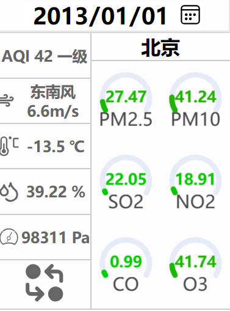
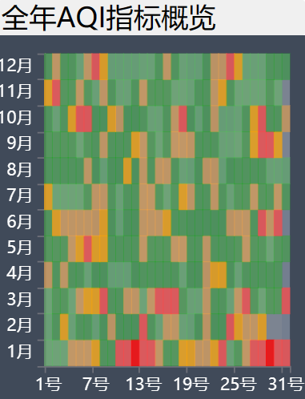
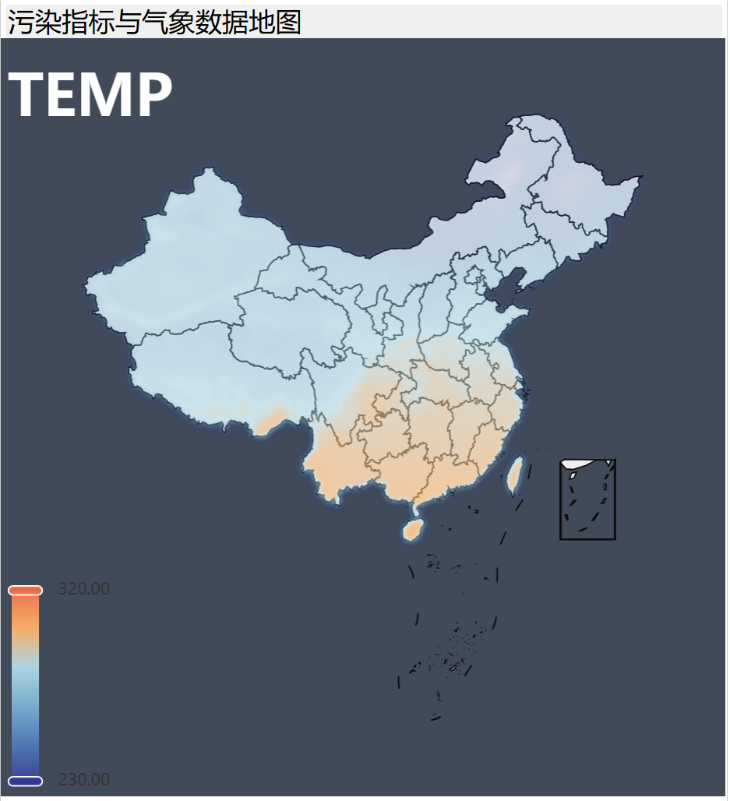
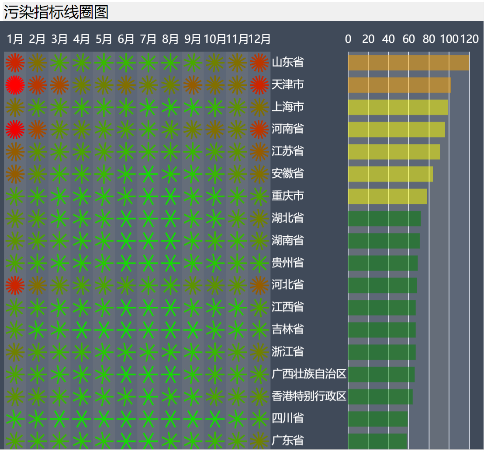
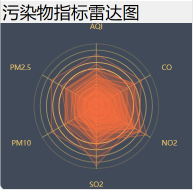
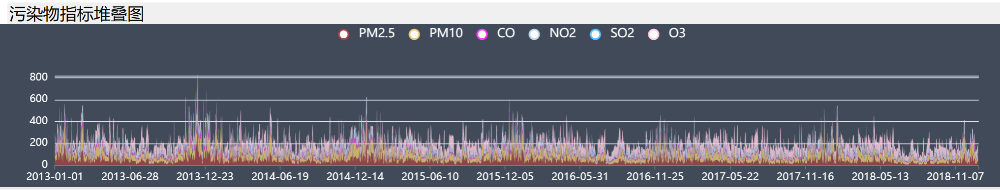
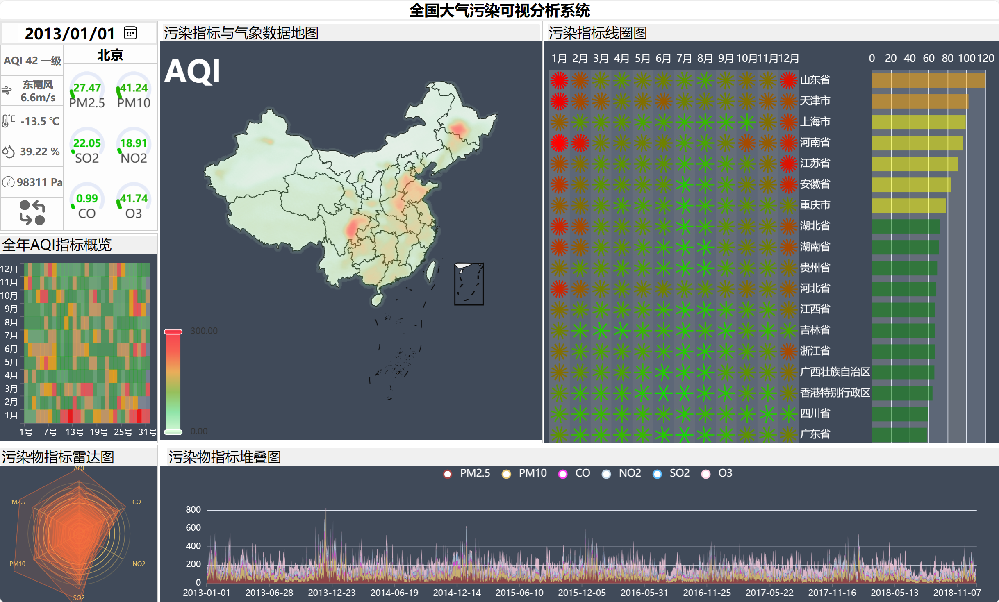

# ChinaVisual

## 数据预处理流程

1. 从官网下载数据
2. 通过java地理包离线计算省市县，写入时将文件中所有空格去除
3. 计算省市聚合数据
4. 计算省聚合数据
5. 对所有文档计算AQI和AQI 等级

## 数据可视化展示
把界面整体分为六个部分，分别是：控制区、全年AQI指标概览、污染指标与气象数据地图、污染指标线圈图、污染物指标雷达图、污染物指标堆叠图。  
+ `控制区`:包含着日历、地区、风向、AQI数值等数据展现，在这些信息框中用户可以点击控制其他区域数据展现，例如切换日历，可以查看切换的日期当天中国地图中的气象数据展现，点击温度框，用户可以查看对应的中国气温图等等。

+ `全年AQI指标概览`:通过柱状图堆叠展现中国地区全年每个月每一天的aqi指标值，用户鼠标悬浮可以查看相关数据。  
  
+ `污染指标与气象数据地图`:通过地图展现选定日期中国地区的各项数据指标情况，可以查看气压、气温、aqi、PM2.5等分布情况，具体实现可以通过控制台进行切换，并且该地图中不仅可以查看省份的具体信息，而且可以通过点击进行下钻，查看省份中各地区的天气情况。  
  
+ `污染指标线圈图`：通过线圈图展现中国所有地区每年的污染物含量情况，更形象的展示了各地区污染情况。

+ `污染物指标雷达图`：展现该省份在目前月份的污染物指标情况，通过雷达图展现出不同污染物在各个维度上的分布情况。
  
+ `污染物指标堆叠图`：通过堆叠图展现该省份从2013年到2018年的污染物随时间变化趋势。

## 开发环境
+ Echarts
+ 原生JavaScript
## 数据来源
来自中国可视化大赛2021年数据，其中地图来源于DataV
## 实现效果
